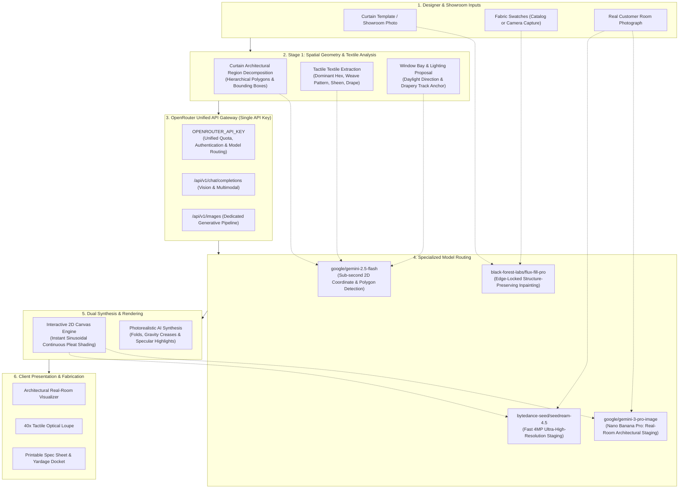

# Aatmi Couture Drapery AI

> **Enterprise Multi-Tenant Architectural Drapery Visualizer, Structure-Preserving Textile Inpainting & Real-Room Staging Platform**

---

## 1. Executive Summary & Objective

In high-end interior architecture and bespoke drapery design, communicating how a custom textile will drape, reflect natural light, and coordinate across multiple panels has traditionally been one of the highest-friction bottlenecks in the industry.

Clients struggle to visualize how a small 4"x4" fabric swatch translates into floor-to-ceiling 10-foot curtains with deep tailored pleats. Interior designers often spend weeks waiting for physical showroom memos, manual Photoshop mockups, or costly 3D renderings that fail to represent real fabric weight and room illumination.

**Aatmi Couture Drapery AI** transforms this process into a real-time, interactive, and photorealistic design experience. It treats the curtain not merely as an image, but as an architectural system composed of functional fabric zones (main drape panels, leading edge borders, weighted hems, headers, and flanking columns) rendered under calibrated environmental lighting and composited into real customer rooms without altering real architectural surfaces.

---

## 2. System Architecture & End-to-End Flow Diagram

The platform utilizes a multi-stage pipeline powered by a **Unified OpenRouter API Gateway**. Brand owners only need **one single API key** (`OPENROUTER_API_KEY`) to access specialized models for vision analysis, structure-preserving inpainting, and real-room staging.



---

## 3. Model Research & Selection: Why These Models?

To deliver museum-grade drapery rendering, different AI tasks demand specialized foundational models. We conducted comprehensive research across vision-language models, masked inpainting systems, and architectural staging engines:

| Pipeline Stage | Critical Technical Requirements | Selected Model (via OpenRouter) | Secondary / Alternative | Rationale for Drapery & Interior Architecture |
| :--- | :--- | :--- | :--- | :--- |
| **Stage 1: Curtain Vision & Geometry** | • Precise 2D coordinate grounding (0–100 normalized polygons)<br>• Hierarchical zone parsing (main drape vs borders vs hems)<br>• Textile fiber, weave & sheen analysis from camera captures | **`google/gemini-2.5-flash`** | `anthropic/claude-3.7-sonnet` (deep aesthetic reasoning) & `qwen/qwen-2.5-vl-72b-instruct` | **Best-in-class spatial grounding**: Gemini 2.5 Flash excels at returning tight polygon vertices without drifting off drapery edges. Its 1M token context window ingests raw 4K showroom photos without downscaling blur, with sub-second (~450ms) turnaround and ultra-low cost ($0.075/1M tokens). |
| **Stage 2: Precision Fabric Inpainting** | • Strict preservation of columnar pleats, fold creases, and shadow troughs<br>• Zero boundary bleeding into neighboring zones or walls<br>• Accurate pattern repeat scaling (1/25th scale) | **`black-forest-labs/flux-fill-pro`** *(FLUX.1 Fill Pro)* | **`google/gemini-3.1-flash-image`** *(Nano Banana 2)* | **Sub-pixel seam locking**: FLUX.1 Fill Pro is built specifically for structure-preserving inpainting. It locks to the zone mask boundary with zero halo, seamlessly draping complex patterns (damasks, velvets, slub linens) into existing fold shadows without flattening volume. |
| **Stage 3: Real-Room Architectural Staging** | • Mounts custom drapery onto customer's real window track<br>• **NO synthetic room hallucination**: keeps customer's real parquet, wall paint, moldings, and furniture 100% intact<br>• Realistic daylight diffusion & contact floor shadow pooling | **`google/gemini-3-pro-image`** *(Nano Banana Pro)* | **`bytedance-seed/seedream-4.5`** *(ByteDance 4MP Staging)* | **Real-photo architectural editing**: Nano Banana Pro understands 3D architectural perspective. Unlike models that generate generic lookalike rooms, it respects the real uploaded room photo, accurately mounting the curtain track and casting natural contact shadows onto the floor. |

---

## 4. Single API Key Architecture via OpenRouter

### The Multi-Vendor Problem
Prior to this integration, supporting high-fidelity drapery design required brands to configure, manage, and fund **four separate vendor platforms**:
1. Google Cloud / AI Studio (for Gemini VLM and Nano Banana Pro)
2. Replicate or Black Forest Labs (for FLUX.1 Fill Pro)
3. OpenAI (for GPT-4o Vision)
4. ByteDance / Stability (for Seedream / SD3.5)

This caused fragmented billing, conflicting rate limits, multiple enterprise account setups, and high onboarding friction.

### The OpenRouter Solution
With OpenRouter as the unified backbone:
- **One Master Key (`OPENROUTER_API_KEY`)**: Brands configure **one single API key** in their `.env` file or directly in the Brand Settings dashboard.
- **Universal Model Access**: That single key instantly routes requests to `google/gemini-2.5-flash`, `black-forest-labs/flux-fill-pro`, `google/gemini-3-pro-image`, and `bytedance-seed/seedream-4.5`.
- **Unified Billing & Quotas**: One credit balance covers all vision analysis, fabric inpainting, and room visualization renders.
- **Zero Vendor Lock-In**: Models can be hot-swapped dynamically without modifying application code or updating provider credentials.

---

## 5. How Brand Owners Configure the API Key

Brand owners can update their API key in **under 30 seconds** using either of two methods:

### Method A: Via the Web Dashboard (Recommended for Brand Admins)
1. Launch the application and click **Settings** (or the Brand avatar) in the top navigation bar.
2. Select the **AI Models** tab.
3. Under **Billing & API Keys**, select **"Use my own API key (BYO Key)"**.
4. Choose **OpenRouter (Unified)** from the provider dropdown.
5. Paste your OpenRouter API key (`sk-or-v1-...`) and click **Test Connection** to verify live ping and model availability.
6. Click **Save Changes** in the bottom bar. All subsequent renders and vision requests will automatically route through your key.

### Method B: Via Environment File (Recommended for Self-Hosting & Showrooms)
Create a `.env` file in the project root (or copy `.env.example`):

```bash
cp .env.example .env
```

Add your OpenRouter key:

```env
# Single Unified Key for all AI capabilities
OPENROUTER_API_KEY=sk-or-v1-xxxxxxxxxxxxxxxxxxxxxxxxxxxxxxxx
```

Restart the server:

```bash
npm run dev
```

---

## 6. Core Application Features

| Feature | Description | Access Point |
| :--- | :--- | :--- |
| **Zone Assignment Panel** | Assign fabrics from the curated catalog or upload custom samples. Fine-tune pattern repeat scale (0.5x to 3.0x) and rotation (0° to 360°). | Left Sidebar / Mobile Sheet |
| **Tactile 40x Weave Loupe** | High-magnification optical loupe displaying yarn gauge, slub texture, thread count density, and sheen response under simulated studio lighting. | "Inspect Weave" Buttons |
| **Real-Room Visualizer** | Upload a photo of your customer's living room or bedroom. The AI detects the window bay and mounts the bespoke curtain with realistic daylight diffusion. | "Room Viz" Studio Tab |
| **Environmental Lighting** | Toggle between **Crisp Daylight (5500K)**, **Golden Hour (2800K)**, and **Evening Luxe (3000K)** to preview fabric warmth and color rendering. | Top Dock / Canvas Bar |
| **Fullness & Yardage Dockets** | Select fullness ratios (**2.0x Casual**, **2.5x Tailored Luxury**, or **3.0x Ultra-Opulent**) and generate printable fabrication cut sheets with yardage allocations. | "Spec Sheet" in Header |
| **Camera Swatch Capture** | Snap fabric swatches in the showroom using your smartphone camera. Real-time perspective correction and texture normalization. | Catalog / Fabric Picker |
| **Multi-Tenant Brand Platform** | Custom theme accent colors, logo branding, model routing preferences, and team permissions per brand atelier. | Brand Admin Dashboard |

---

## 7. Technology Stack

- **Frontend:** React 18+ with TypeScript & Vite
- **Styling:** Tailwind CSS with CSS design tokens (`--color-accent`, `--color-bg-surface`, `--color-border-subtle`)
- **Icons:** Lucide React
- **Canvas Rendering:** HTML5 2D Canvas Engine with sinusoidal vertical pleat shading & offscreen rasterization
- **AI Gateway:** OpenRouter Unified API (`https://openrouter.ai/api/v1`)
- **Specialized AI Models:**
  - *Vision:* `google/gemini-2.5-flash` & `anthropic/claude-3.7-sonnet`
  - *Inpainting:* `black-forest-labs/flux-fill-pro` & `google/gemini-3.1-flash-image`
  - *Room Staging:* `google/gemini-3-pro-image` (Nano Banana Pro) & `bytedance-seed/seedream-4.5`
- **Backend:** Node.js Express server (`server.ts` & `src/server/api.ts`)

---

## 8. Quickstart & Local Development

```bash
# 1. Install dependencies
npm install

# 2. Configure environment (add your OpenRouter key)
cp .env.example .env

# 3. Start development server
npm run dev

# 4. Open in browser
# Studio UI: http://localhost:3000
# API Health: http://localhost:3000/api/health
```

### Production Build
```bash
npm run build
```

---

*Crafted for luxury interior ateliers, bespoke drapery workrooms, and discerning architectural designers.*
