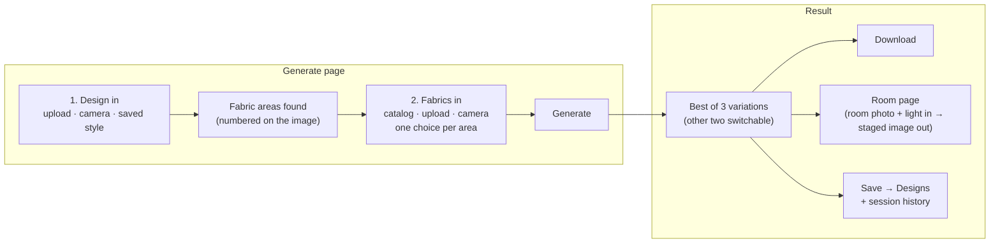
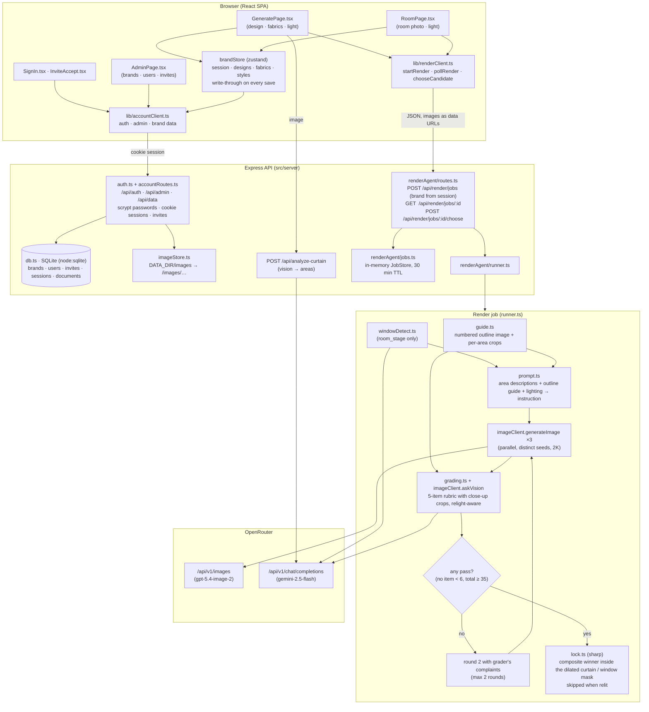

# Aatmi Curtain Studio

A brand tool for curtain makers. Staff put a curtain design in, choose a fabric for any area of it, and get a client-grade image out. Optionally the result is placed into a photo of the customer's room. One OpenRouter key powers everything.

- **Stack:** Vite + React 19 single-page app, Express API, zustand state, vitest. `sharp` for server-side image compositing.
- **Models (via OpenRouter):** `openai/gpt-5.4-image-2` (GPT Image 2) for generation, `google/gemini-2.5-flash` for analysis and grading. Both are overridable through env vars; `google/gemini-3-pro-image` is the tested alternative for generation.
- **Accounts and data:** built into the server. Users, brands, invites and sessions plus each brand's designs, fabrics and styles live in one SQLite file (Node's built-in `node:sqlite`); images are stored as files and served from `/images/`. Render jobs still live in the server process.

---

## 1. The flow

The app has four pages: **Home**, **Generate**, **Library**, **Designs**, plus **Room** (reached from Generate or a design) and **Brands** (admins). Generate is where the work happens.



1. **Design in.** Drop a curtain photo or drawing, take a photo, or pick a saved style from the Library. The image is sent to the analyzer, which returns the fabric areas (top band, accent band, skirt, left and right panels, and so on) with a plain-language name, a description and a polygon each. The areas are numbered on the image, each label at its area's centre and pushed apart when two would overlap.
2. **Fabrics in.** Each area gets a row with a Choose button. Sources: the catalog (photographed fabrics only), a file upload, or the camera. Areas with the same name (mirrored panels) share one choice. Areas left alone stay exactly as photographed.
3. **Light.** As photographed (background stays pixel-identical), Daylight, Golden hour, Evening or Night. Anything but "as photographed" relights the whole image, so the pixel lock is skipped and the grader is told not to penalise lighting changes.
4. **Generate.** One button. About a minute later the best of three variations is shown; the other two can be switched to (a switch is re-locked on the server). **Save** names the result and stores it under Designs; Download gives the full-resolution PNG; every generation is listed in the session history strip.
5. **Room.** "Place in a room" opens the Room page: the saved curtain, a room photo (upload or camera), a light choice, and three graded placements, each kept on the design.

Size rules: images under 240 px wide are refused (the analyzer has nothing to work with); under 1500 px a note explains the background will be softer. The generated image is always at the model's full resolution (about 2K on the long side), never shrunk to the source.

---

## 2. Architecture



### Render job, stage by stage

| Stage | Module | What happens |
| --- | --- | --- |
| Validate | `routes.ts` | zod-validates the body, requires every image to be a PNG/JPEG/WEBP data URL, resolves the brand's OpenRouter key, enforces the monthly quota (one unit per job), returns `202 { jobId }`. |
| Guide | `guide.ts` | Draws the photo with every area outlined in its own colour and numbered (labels at the area centroids, de-overlapped), and cuts an upscaled close-up of each changed area. Both are made locally with `sharp`; nothing is sent to a model for this. |
| Prompt | `prompt.ts` | Builds one instruction from the design's areas: an image legend (Image 1 the photo, Image 2 the numbered outline guide, then one swatch per changed area), a "replace area N, outlined in Image 2, … edge to edge" line per changed area with its extent in percent, a preservation clause naming every untouched area and the background, and the lighting clause when the light is changed. |
| Generate | `imageClient.ts` | One call by default, up to three in parallel with distinct seeds (the page's Variations control), at 2K, aspect ratio matched to the source. Hosted-URL results are downloaded and normalised to data URLs. On a `400` the client falls back once to chat-completions image output. 120 s timeout per call. |
| Grade | `grading.ts` | A vision model sees the original, the swatches, the candidate and a close-up crop of every changed area, and scores 0–10 on: target areas fully covered edge to edge, other areas unchanged, pleats and lighting preserved, no artifacts, likeness to the swatch. Pass = target areas ≥ 7, every other item ≥ 6, total ≥ 35. |
| Select / retry | `runner.ts` | Highest-scoring pass wins. If none pass, one more round runs with the grader's below-threshold reasons appended to the prompt. After two failed rounds the job ends `needs_review` with the best candidate. A single failed candidate never kills a round (`Promise.allSettled`). |
| Lock | `lock.ts` | The winner is composited inside a feathered mask over the original: the union of the area polygons grown by 2.5 % (so a loose polygon cannot reveal old fabric at a seam), or for room staging the detected window box expanded 20 %. Output is at the larger of the source and candidate resolution. Skipped when the light was changed. |
| Store | `jobs.ts` | Result, prompt and all candidates with scores are kept on the job. In-progress polls omit candidate images; the terminal response includes them. The GET view never carries the API key or the input images. |

**Room staging** is the same job with `kind: 'room_stage'`: a window-detection call first (`windowDetect.ts`, returns a box covering the window and any existing curtains, or a fatal `NO_WINDOW_DETECTED`), then the same generate → grade → lock loop with a room-specific rubric.

**Errors** are classed in `errors.ts`: `429`/`5xx`/timeouts/malformed grader JSON are retried (2 retries, 2 s then 6 s); `401`/`403`/`400`/no window are fatal and end the job with a readable message.

### Source layout

```
src/
  App.tsx                      view router (dashboard · editor=Generate · library · design_detail · settings)
  components/brand/
    GeneratePage.tsx           the Generate page (design in, fabrics in, light, image out)
    RoomPage.tsx               place a saved curtain in a room photo
    AdminPage.tsx              admins: brands and invites
    DesignDetailView.tsx       a saved design: rerun, room placements, share, spec sheet
    BrandDashboard.tsx         Home
    library/                   Library: styles and fabrics tabs
    CameraCaptureModal.tsx     photograph a fabric
    StylePickerModal.tsx       pick a saved style
  components/NewTemplateModal.tsx   add a style from a photo (analyzer) or a stencil preset
  pages/SignIn.tsx, pages/InviteAccept.tsx
  lib/
    areaGeometry.ts            centroids, label de-overlap and extent text, shared by the page and the guide image
    renderClient.ts            browser client for the render job API
    accountClient.ts           browser client for auth, admin and brand data
    brandStore.ts, store.ts    zustand stores (session, brand data with write-through)
  server/
    api.ts                     Express app: mounts auth, admin, data, images, analyzer and /api/render
    db.ts, auth.ts, imageStore.ts, accountRoutes.ts   accounts and persistence
    renderAgent/               the render pipeline (one file per stage, tests alongside; guide.ts makes the outline image and crops)
    openrouter.ts              key resolution and model constants
    images.ts, brandConfigs.ts shared helpers
  types/                       CurtainTemplate, Region, Fabric, Design, RoomPreview
  data/                        built-in catalog (styles, fabrics)
docs/superpowers/specs/        design documents (render agent, Generate page)
```

---

## 3. Accounts

- **One brand per login.** A user belongs to exactly one brand. The header shows the brand; there is no switching. The admin belongs to a home brand too (`ADMIN_BRAND`, default "Aatmi") and lands on Home like everyone else, with an extra **Brands** tab.
- **Admins create brands and their users.** There is no public sign-up. On the Brands page an admin creates a brand, then either **adds a user** with a password to hand over, or creates an **invite link** (`/invite/<token>`, valid 7 days, single use) so the person sets their own.
- **Admin credentials come from `.env`.** On every start the server makes `ADMIN_EMAIL` / `ADMIN_PASSWORD` authoritative: it creates that admin or resets its password. Restart the server after changing them.
- Passwords are hashed with scrypt and a per-user salt. Sessions are random tokens in an `HttpOnly` cookie, 30 days. Suspended brands cannot sign in.
- A brand's designs, fabrics and uploaded styles are loaded on sign-in and written through on every save; the built-in catalog is merged in as platform defaults. Any data-URL image inside a saved document is moved to the image store before the JSON is written.

Tables: `brands`, `users`, `invites`, `sessions`, `documents(brand_id, collection, id, json)`. Code: `src/server/db.ts`, `auth.ts`, `imageStore.ts`, `accountRoutes.ts`; client `src/lib/accountClient.ts`, pages `SignIn.tsx`, `InviteAccept.tsx`, `AdminPage.tsx`.

## 4. API

| Route | Purpose |
| --- | --- |
| `POST /api/auth/login`, `POST /api/auth/logout`, `GET /api/auth/me` | session |
| `GET /api/auth/invite/:token`, `POST /api/auth/invite/:token/accept` | invite lookup and acceptance |
| `GET/POST /api/admin/brands`, `PATCH /api/admin/brands/:id`, `POST /api/admin/brands/:id/users`, `POST /api/admin/brands/:id/invites` | admin only |
| `GET /api/data/:collection`, `PUT /api/data/:collection/:id`, `DELETE …` | the signed-in user's brand documents (`designs`, `fabrics`, `templates`) |

| Route | Purpose |
| --- | --- |
| `GET /api/health` | key presence and feature flags |
| `POST /api/analyze-curtain` | `{ imageBase64, mimeType }` → `{ regions[] }` with `display_name`, `description`, `location`, `polygon_coords` |
| `POST /api/render/jobs` | start a `fabric_swap` or `room_stage` job → `202 { jobId }`; `400` invalid, `401 BAD_KEY`, `402 QUOTA_EXCEEDED` |
| `GET /api/render/jobs/:id` | `{ status, stage, round, candidates, result?, error? }`; poll every 2 s |
| `POST /api/render/jobs/:id/choose` | `{ candidateId }` → re-locks that candidate and returns the updated job |
| `GET/PATCH /api/model-config` | the signed-in brand's providers, key mode and BYO key (key is stored in memory, never returned; quota fields are admin-only) |
| `POST /api/test-provider` | checks a key against OpenRouter (signed-in users) |

`fabric_swap` body: `{ kind, brandId, templateName, templatePhoto, zones[{ id, display_name, description, location, polygon_coords }], changes[{ regionId, fabricName, weave, colorHex, category, swatch }], curtainMask? }`.
`room_stage` body: `{ kind, brandId, roomPhoto, curtainImage }`. All images are data URLs.

Everything except `/api/health` and `/api/auth/*` requires a session, including `/images/…`. Render jobs are only visible to the brand that started them.

---

## 5. Configuration

Copy `.env.example` to `.env`.

| Variable | Required | Meaning |
| --- | --- | --- |
| `OPENROUTER_API_KEY` | yes | the one key for analysis, generation, grading and staging. A brand can also store its own key in Settings. |
| `OPENROUTER_ROOM_VIZ_MODEL` | no | image generation model (default `openai/gpt-5.4-image-2`) |
| `OPENROUTER_VISION_MODEL` | no | analysis, window detection and grading (default `google/gemini-2.5-flash`) |
| `GEMINI_API_KEY`, `GEMINI_IMAGE_MODEL` | no | direct Gemini fallback for the generate stage only |
| `ADMIN_EMAIL`, `ADMIN_PASSWORD`, `ADMIN_NAME`, `ADMIN_BRAND` | yes | the admin account (created or reset on every start) and its home brand |
| `DATA_DIR` | no | where the SQLite file and images live (default `./data`) |
| `APP_URL` | no | public URL used in invite links (default: the request host) |

The dev server reads `.env` at start. If you change the key, restart it: `dotenv` never overrides a value already in the process environment.

---

## 6. Run, test, build

```bash
npm install
cp .env.example .env        # add your OpenRouter key
npm run dev                 # http://localhost:3000 (API is mounted inside Vite)
npm test                    # vitest: 14 files, ~100 tests, node environment
npm run lint                # tsc --noEmit
npm run build               # vite build → dist/
npm start                   # tsx server.ts: serves dist/ and the API on :3000
```

Tests cover every pipeline stage with real behaviour and only the provider calls mocked: prompt text is asserted verbatim, grading maths is exercised, the pixel lock is checked by reading pixels back through `sharp`, the routes are hit over real HTTP.

---

## 7. Quality rules and known limits

- Only photographed fabrics are offered in the picker; the drawn SVG tiles in the built-in catalog are filtered out because the model cannot reproduce them convincingly.
- The built-in sample styles are 250–450 px wide. They generate, but a real photo at 1500 px or wider gives a sharper background. Add your own styles through the Library or straight into Generate.
- Built-in styles carry hand-drawn area polygons in `src/data/defaultCatalog.ts`. Wrong polygons show up as piled-up labels and half-replaced borders; the Greek key style was redrawn from its photo on 2026-09-14 and the chevron band style on 2026-09-15; the other four have not been audited. Each built-in style must have its own photo (`src/data/defaultCatalog.test.ts` enforces it): four placeholder styles that borrowed another style's photo were removed on 2026-09-15. To see exactly what the model is told, render the guide with `drawAreaGuide` from `src/server/renderAgent/guide.ts`.
- The background outside the curtain (or outside the window box, for staging) is guaranteed pixel-identical to the source. A manually chosen runner-up is re-locked on the server before it is shown.
- A job costs one image generation and one grading call per variation (default 1; up to 3), doubled if a retry round runs. About 25 s per variation.
- Render jobs are in memory: a server restart drops running jobs. Saved designs, fabrics, styles and accounts persist in `DATA_DIR`; back that directory up.
- Invite links are shown to the admin to send by hand; there is no email delivery or password reset yet.
